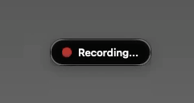
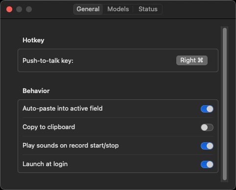
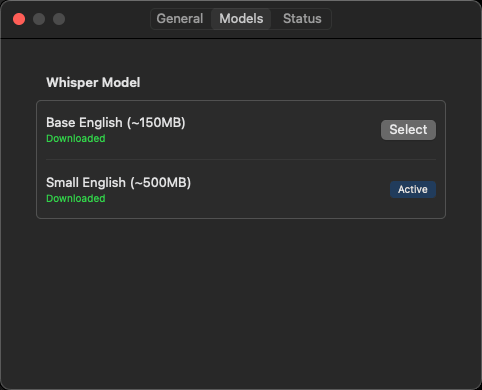
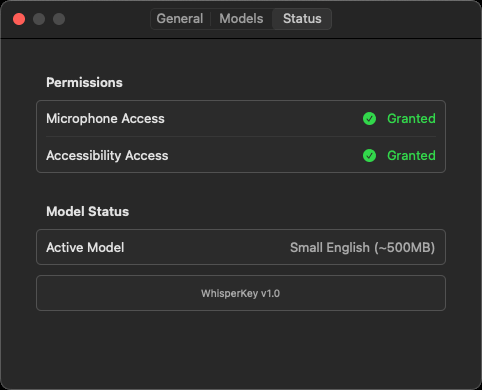

# Leak Flow

**Talk instead of type, on your Mac. Everything stays on your computer.**


Leak Flow sits in the menu bar at the top of the screen. Hold a key, say
what you want to say, let go, and your words show up wherever you were
typing: a message, an email, a note, anything. It's like dictation, but
it works everywhere and it doesn't send your voice anywhere. The
listening and the typing both happen on your own Mac.

<p align="center">
  
</p>

<p align="center">
  
  
  
</p>

## What it does

| | What it does |
|---|---|
| 🎙️ **Hold to talk** | Hold your key (Right Option to start with, and you can change it), talk, let go. |
| ✍️ **Types it for you** | Pastes the words where your cursor is, and keeps a copy on the clipboard too. |
| 🔒 **Stays on your Mac** | No accounts, no cloud, no subscription. Your voice never leaves the computer. |
| 👀 **Shows it's listening** | A small floating window while it's recording, so you're never guessing. |
| ⬇️ **Sets itself up** | Downloads the speech model the first time it opens. |
| 🚀 **Opens with your Mac** | If you want it to. |

Around 10 seconds of talking turns into text in about 3 seconds on an
Apple Silicon Mac.

## What you need

- A Mac on macOS 14 (Sonoma) or newer
- Xcode 15 or newer, to build it
- Two permissions: **Microphone** and **Accessibility** (more on those below)

## Building it

```bash
git clone https://github.com/malikacodes/leak-flow.git   # download the code
cd leak-flow                                            # go into the folder
open LeakFlow.xcodeproj                                 # open it in Xcode
```

Then press **Cmd+R** in Xcode to build it and open it.

There's also a `Makefile` for making a zipped copy of the app:

```bash
make zip   # builds the app and zips it into build/LeakFlow.zip
```

## Using it

1. Open Leak Flow. A microphone icon shows up in the menu bar.
2. Say yes to the **Microphone** and **Accessibility** permissions.
3. The first time, it downloads the speech model (about 150 MB). Give it
   a minute.
4. **Hold your key**, talk, **let go**.
5. Your words get pasted in, and copied to the clipboard.

## Permissions (and why it needs them)

| Permission | Why | How to turn it on |
|---|---|---|
| **Microphone** | So it can hear you | Your Mac asks the first time |
| **Accessibility** | So it can notice your key from any app, and paste for you | System Settings → Privacy & Security → Accessibility → turn on Leak Flow |

Leak Flow walks you through both the first time it opens.

## Settings

Click the menu bar icon, then **Settings**:

- **Hotkey:** click "Record Shortcut" and press the key you want to use.
- **Model:** base.en is faster (about 150 MB). small.en is more accurate
  (about 500 MB).
- **Auto-paste:** switch off if you only want it copied, not pasted.
- **Sound effects:** a little sound when it starts and stops listening.
- **Launch at login:** opens Leak Flow when you log in.

## How it's put together

Each part does one job:

- **HotkeyManager** notices when you press and let go of your key, in any app
- **AudioRecorder** records your voice (in the format the speech model wants)
- **WhisperTranscriber** turns the recording into text, on your Mac
- **TextOutputManager** copies the text and pastes it in for you

## Privacy

- Your voice is turned into text **on your Mac**, not on a server.
- The only time it goes online is to download the speech model once.
- No tracking, no analytics, nothing collected.
- Recordings are kept in memory just long enough to become text, then
  thrown away.

## Thank you

Leak Flow started from [WhisperKey](https://github.com/mark-software/WhisperKey)
by Mark Miller, shared under the MIT license. It also wouldn't exist
without:

- [whisper.cpp](https://github.com/ggerganov/whisper.cpp) by Georgi Gerganov, which does the actual listening
- [Whisper](https://github.com/openai/whisper), the speech model underneath it
- [Hugging Face](https://huggingface.co/), where the model is downloaded from

## License

[MIT](LICENSE)
